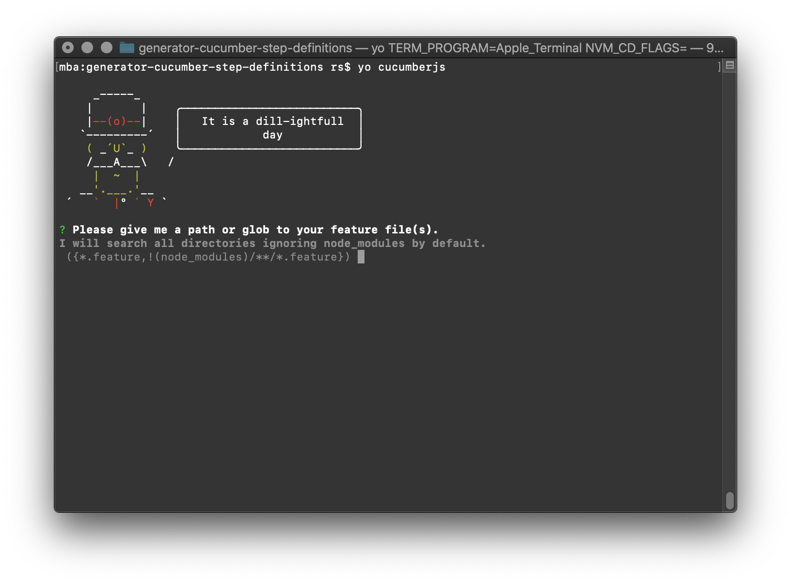

# Cucumber JS Step Definitions Generator

This tool transforms your undefined `.feature` files into JavaScript step
definitions – because life is too short to copypasta them all the time.

Unlike other generators, this tool uses cucumber-js features directly to parse
and transform the gherkin syntax.

## Quick Start

1. `npm i -g yo` Install yeoman
2. `npm i -g generator-cucumberjs` Install this generator
3. `yo cucumberjs` Run this generator, it'll guide you through the rest.
